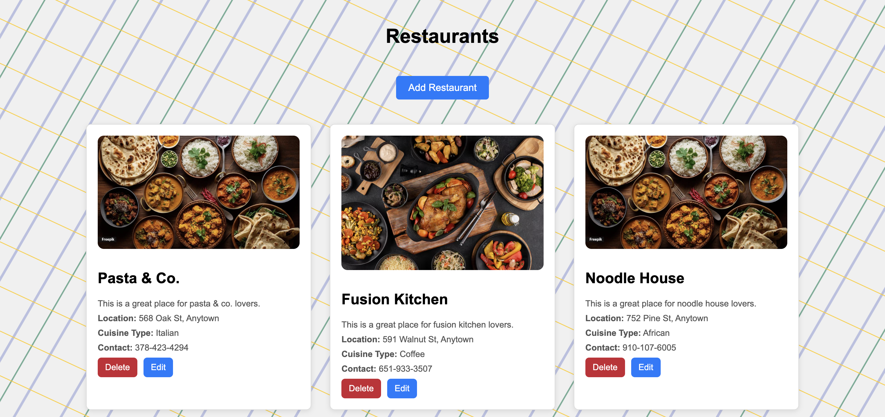

# Foodie Delight

## A Food site made using HTML, CSS, JavaScript, React, React Hook Form, API, Axios, Frontend, Backend, Express.

### [Foodie Delight](https://foodie-light-client.vercel.app/)



#### STEPS TO SETUP SERVER:

> Copy commands from below one by one and execute in terminal to run it locally

```bash
git clone https://github.com/deepak-tiwari-dt/foodie-light-server.git

cd foodie-light-server

npm install

npm install express cors && npm install --save-dev nodemon

npm start
```
